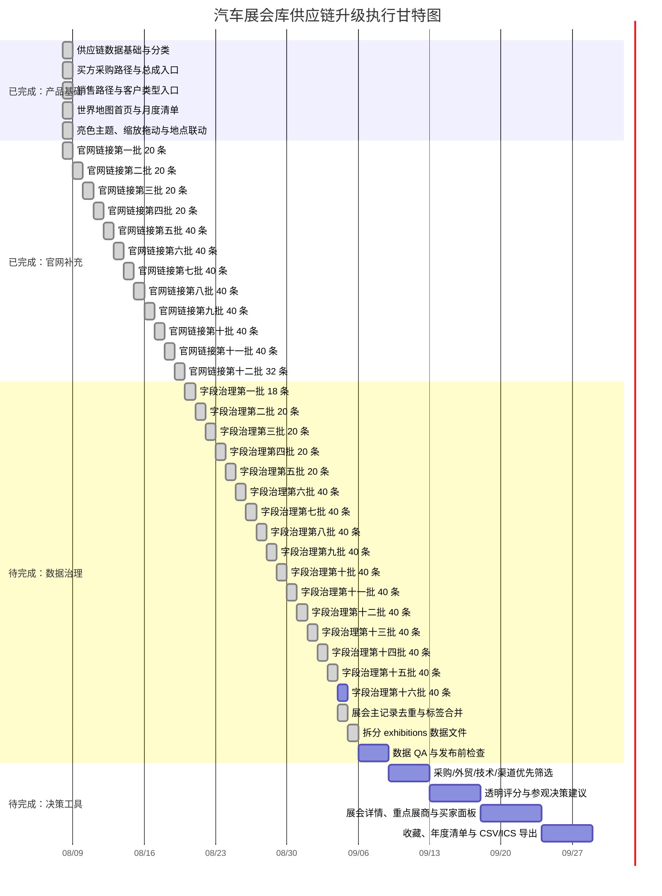

# 全球汽车展会聚合平台：项目进度与甘特图

> 进度基准：2026-08-08。甘特图按执行阶段展示，日期用于排序，不代表对外承诺的交付日期。

## 当前比例

| 工作范围 | 当前完成 | 剩余 | 计算口径 |
|---|---:|---:|---|
| 网站基础工作台 | 100% | 0% | 地图首页、年月筛选、当月全量列表、地图缩放拖动、地点联动、亮色主题、买方/销售路径已实现 |
| P0 数据底座 | 87.5% | 12.5% | 8 项 P0 任务中已完成 7 项；剩余重点海外展会字段补齐 |
| 官网链接覆盖 | 100% | 0% | 608 条记录全部已有来源或官方链接 |
| 官网补充批次 | 12 批 / 12 批 | 已完成 | 已新增 392 条规则；每批均独立检查和提交，最后一批补齐剩余 32 条 |
| 重点字段补齐 | 569 / 569 条 | 0 条 | 结构化字段已全覆盖；131 条地址保留“待核验”，进入来源复核维护 |
| 供应链决策层 | 基础版 | 深化中 | 买方/卖方入口和标签已具备，评分、详情、收藏和行程工具待做 |

官网链接覆盖率按展会记录统计，官方链接规则可能被同系列多条记录复用，因此“80 条规则”不等于“80 条展会记录”。

## 执行甘特图

## 剩余工作量

当前最明确的剩余量是官网数据：

- 已覆盖：569 / 569 条主记录。
- 待补充：0 / 569 条主记录。
- 官网入口补充已完成；后续重点转入地址、受众、来源可信度、重复主记录和重点展会字段治理。
- 重点字段当前覆盖：地址字段 569 条、适合人群 569 条、官方来源 569 条；其中 378 条地址已确认，191 条地址待场馆核验。
- 重点顺序：动力电池、电驱、充换电、车规芯片、线束连接器、再制造、供应链软件、贸易合规，再扩展到区域汽配和整车展。

数据治理剩余重点：

- 将 `exhibitions` 从 `index.html` 拆到独立数据文件。
- 重复主记录已合并，保留 `relatedCategories`、`relatedSupplyChains` 和 `aliases` 多标签信息。
- 原始国内/海外标注冲突已处理 81 条，当前严格审计冲突为 0。
- 为 131 条“待核验”地址补充主办方场馆确认、展商名录和报名入口。
- 建立展会系列与地区分展清单，继续核查 Motortec、Automechanika、TAPA、Battery Show、SEMICON、Intersolar 等品牌是否存在漏收分展。
- 地图坐标覆盖已提升至 558 / 562 条 2026 主数据，剩余 4 条无城市信息的“待定”记录不强行定位。

## 更新规则

每完成一批官网：

1. 更新 `data/official-exhibition-links.js`。
2. 用真实展会名称做本批精确命中检查。
3. 更新本文件的覆盖率和剩余条数。
4. 更新 `docs/CHANGELOG.md`。
5. 单独提交并推送，下一批再开始。
