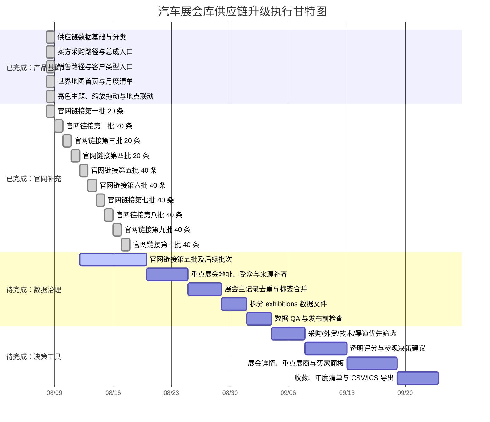

# 全球汽车展会聚合平台：项目进度与甘特图

> 进度基准：2026-08-08，当前分支最新提交 `2d8f394`。甘特图按执行阶段展示，日期用于排序，不代表对外承诺的交付日期。

## 当前比例

| 工作范围 | 当前完成 | 剩余 | 计算口径 |
|---|---:|---:|---|
| 网站基础工作台 | 100% | 0% | 地图首页、年月筛选、当月全量列表、地图缩放拖动、地点联动、亮色主题、买方/销售路径已实现 |
| P0 数据底座 | 62.5% | 37.5% | 8 项 P0 任务中已完成 5 项；剩余拆分数据、QA 和重点展会字段补齐 |
| 官网链接覆盖 | 85.0% | 15.0% | 608 条记录中 517 条已有来源或官方链接，91 条仍待补 |
| 官网补充批次 | 10 批 / 10 批 | 第十一批继续 | 已新增 320 条规则；从第五批开始按每批 40 条独立检查和提交 |
| 供应链决策层 | 基础版 | 深化中 | 买方/卖方入口和标签已具备，评分、详情、收藏和行程工具待做 |

官网链接覆盖率按展会记录统计，官方链接规则可能被同系列多条记录复用，因此“80 条规则”不等于“80 条展会记录”。

## 执行甘特图

## 剩余工作量

当前最明确的剩余量是官网数据：

- 已覆盖：517 / 608 条记录。
- 待补充：91 / 608 条记录。
- 从第五批开始按每批 40 个官网计算，约还需要 8 批；最后一批可能少于 40 个。
- 重点顺序：动力电池、电驱、充换电、车规芯片、线束连接器、再制造、供应链软件、贸易合规，再扩展到区域汽配和整车展。

数据治理剩余重点：

- 将 `exhibitions` 从 `index.html` 拆到独立数据文件。
- 合并 33 组重复记录，避免同一展会在不同分类下重复展示。
- 处理 85 条原始国内/海外标注冲突。
- 为重点海外展会补齐详细地址、适合人群、展商名录和报名入口。

## 更新规则

每完成一批官网：

1. 更新 `data/official-exhibition-links.js`。
2. 用真实展会名称做本批精确命中检查。
3. 更新本文件的覆盖率和剩余条数。
4. 更新 `docs/CHANGELOG.md`。
5. 单独提交并推送，下一批再开始。
